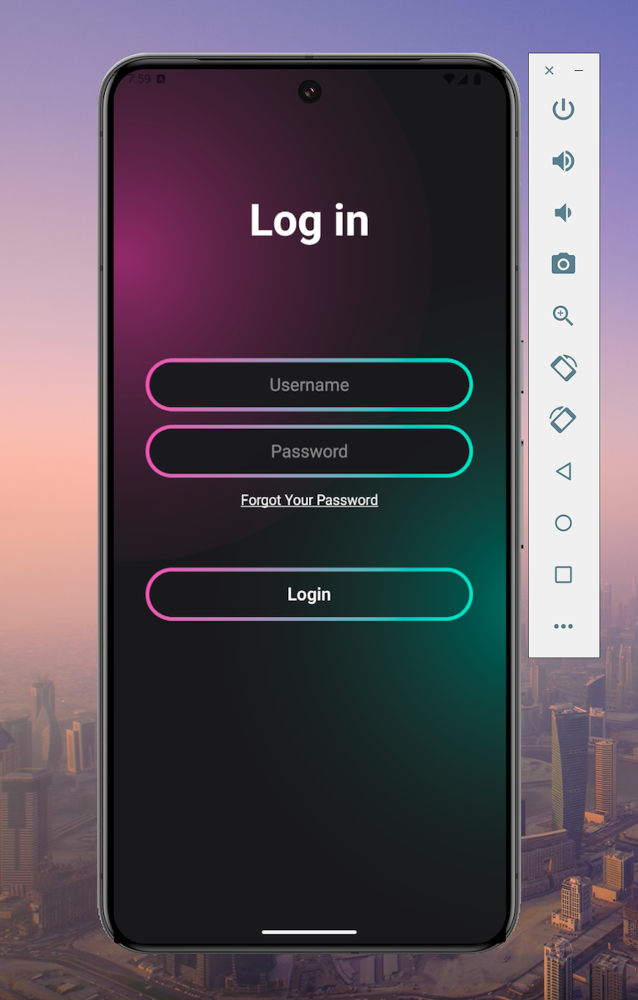
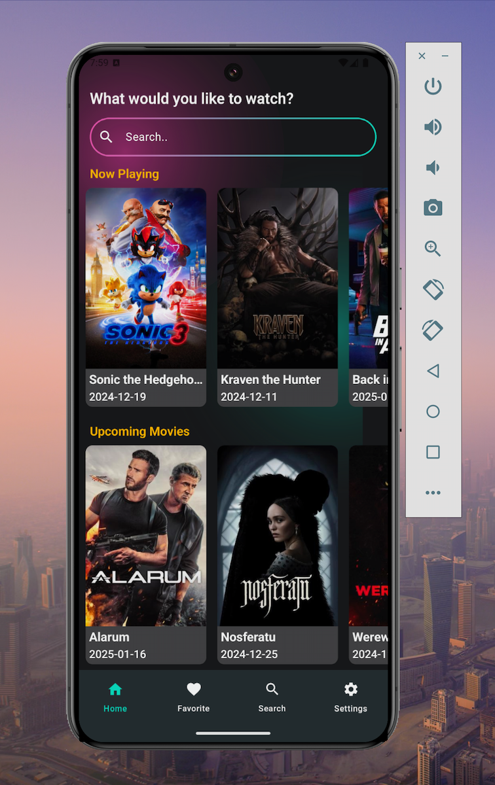
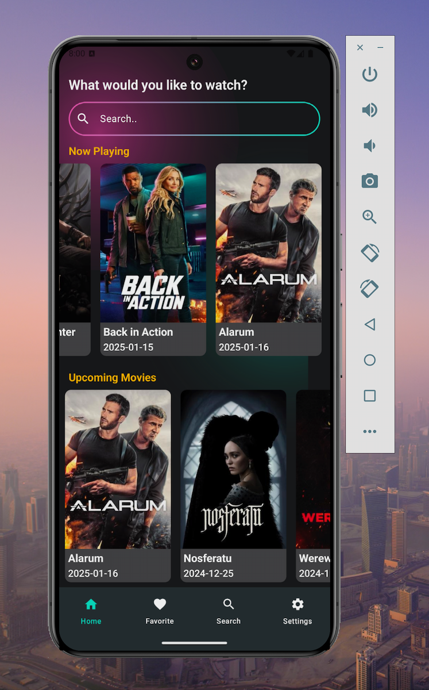
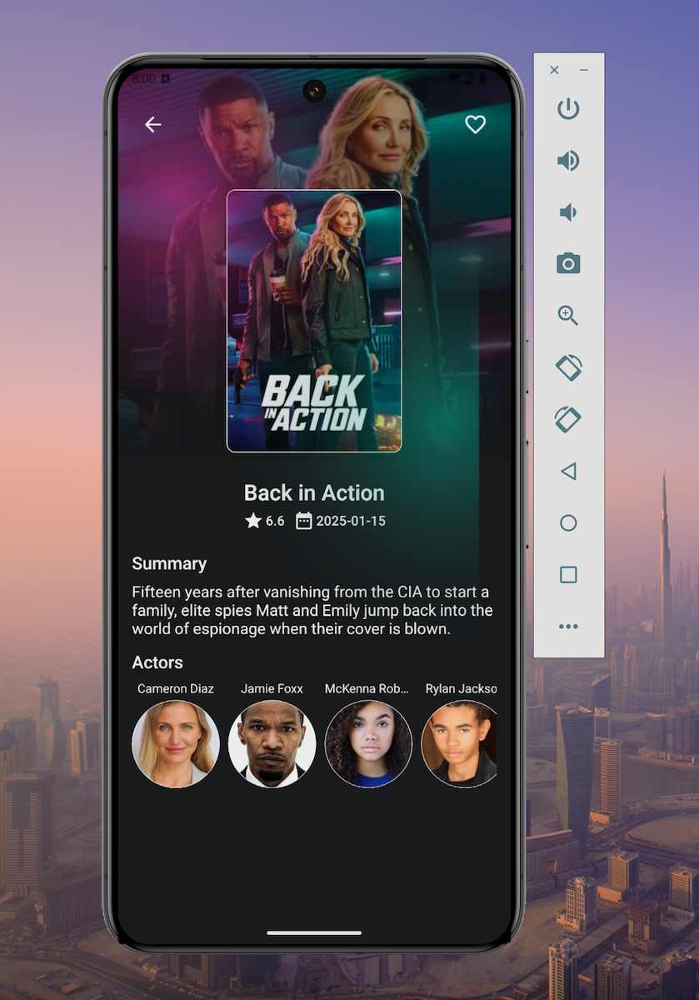
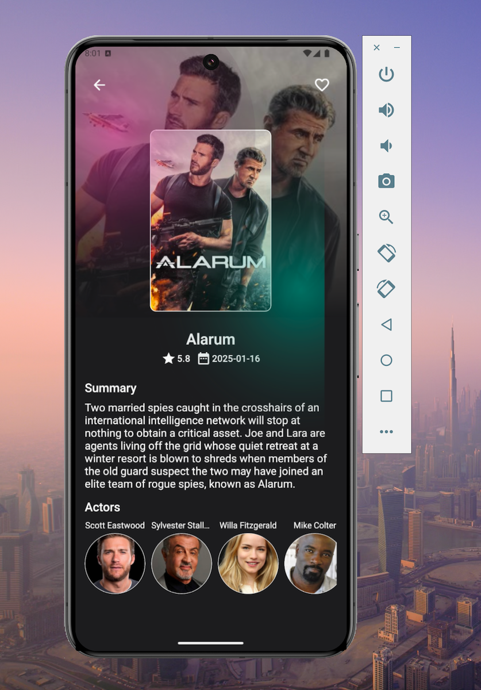
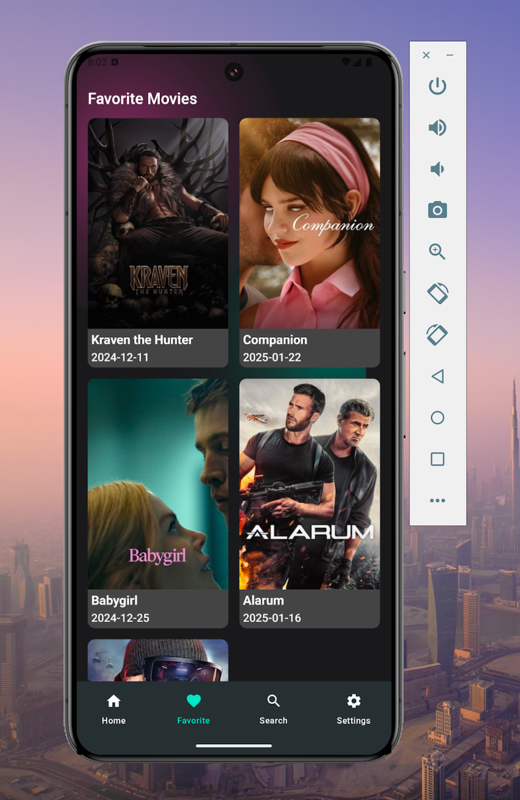

# MovieTicketHub

MovieTicketHub 是一个全栈 Android 电影浏览与影院购票应用。项目由 Jetpack Compose 客户端和 Flask + SQLite 服务端组成，覆盖账号安全、场次库存、座位锁定、订单、模拟支付、收藏同步与个性化推荐等功能。

> 本项目用于开发与演示。支付渠道为模拟实现，不能用于处理真实资金。

## 已实现功能

- 通过猫眼电影接口浏览正在热映和即将上映的电影；支持搜索、查看影片详情、演职员与简介。
- 支持游客浏览；收藏、选座和购票会自动触发登录门控。
- 支持注册、登录、会话恢复和退出登录；令牌在设备端加密保存，并可由服务端撤销。
- 可按城市、影院、日期、行政区、时间段、价格范围、距离和排序方式查询场次。
- 在实时座位图中选择 1–6 个座位；服务端拥有最终库存裁决权，并创建 10 分钟有效的座位锁。
- 获取服务端权威报价、幂等创建订单、使用模拟支付宝/微信支付、查看电子票并退款。
- 以 Room 实现离线优先收藏，通过操作队列、幂等键和服务端 revision 完成跨设备增量同步。
- 根据已确认收藏、购票、热度、新鲜度和协同信号生成可解释的个性化推荐；游客和冷启动场景可安全降级。

## 界面截图

以下模拟器界面截图已包含在仓库中。

<p align="center">
  
  
  
  
</p>

<p align="center">
  
  
  
</p>

## 架构概览

```text
Jetpack Compose UI
  └─ ViewModel + StateFlow（MVI 风格单向状态流）
       └─ Domain Repository
            ├─ 通过 Ktor 访问猫眼电影接口
            ├─ 通过 Ktor + Bearer Token 访问 Flask REST API
            └─ 使用 Room 缓存数据与离线收藏操作队列

Flask API
  ├─ auth             密码哈希、会话、限流、退出登录
  ├─ showtimes        本地时区筛选、距离排序、版本校验
  ├─ seats            实时库存、锁座、过期处理、并发控制
  ├─ orders           报价、订单、票券、退款、审计事件
  ├─ payments         模拟支付尝试与可验签 webhook
  ├─ favorites        操作日志、revision、增量同步
  └─ recommendations  混合排序、降级策略、行为指标
       └─ SQLite（开发环境存储）
```

Android 客户端按 `presentation`、`domain`、`data` 分层。客户端负责渲染状态并发起请求；服务端负责会话、库存、价格、支付结果和已确认收藏等业务事实的最终判定。

## 关键技术设计

| 领域 | 实现方案 |
| --- | --- |
| 会话安全 | 使用 Werkzeug scrypt 保存密码哈希；服务端仅保存 Token 的 SHA-256 摘要；Android 端以 Android Keystore AES/GCM 加密保存 Token。 |
| 锁座并发 | 使用 SQLite `BEGIN IMMEDIATE`、带库存状态条件的更新、幂等键、座位集合指纹和过期清理，避免重复有效锁。 |
| 金额与订单 | 全部金额均使用整数最小货币单位；报价确认、订单、支付尝试、票券和状态事件均由服务端权威且幂等地处理。 |
| 收藏同步 | Room 分离用户期望状态和服务端确认状态；按账号隔离的操作队列和 revision 游标保证重试和多设备收敛安全。 |
| 推荐 | 确定性的混合排序会排除已收藏/已购电影，保存可解释的推荐快照，并支持事件去重。 |

更深入的实现说明请阅读：[项目技术总结](docs/项目技术总结.md) 与 [Spring Boot 后端重构成本评估](docs/SpringBoot后端重构成本评估.md)。

## 技术栈

| 层级 | 技术 |
| --- | --- |
| Android | Kotlin、Jetpack Compose、Material 3、Navigation Compose、ViewModel、StateFlow、Coroutines |
| 客户端数据层 | Ktor 3、kotlinx.serialization、Coil 3、Room 2.6、Koin 4、Android Keystore |
| 服务端 | Python 3、Flask 3、SQLite、标准库 HMAC |
| 测试 | Python `unittest`、Flask test client、JUnit、Ktor Mock、Room Testing、Compose UI Test |

## 本地运行

### 前置条件

- 安装 Android Studio 和 Android SDK/模拟器（Android API 24 及以上）
- 安装与 Gradle 构建兼容的 JDK
- 推荐使用 Python 3.12 及以上

### 1. 启动后端

在项目根目录执行：

```powershell
python -m venv backend/.venv
backend/.venv/Scripts/python.exe -m pip install -r backend/requirements.txt
backend/.venv/Scripts/python.exe backend/app.py
```

开发 API 默认运行在 `http://127.0.0.1:5000`。Android Debug 构建已配置为通过 `http://10.0.2.2:5000` 从模拟器访问宿主机服务。

### 2. 运行 Android 应用

在 Android Studio 中打开项目根目录，选择模拟器或真机，然后运行 `app` 配置；也可以执行：

```powershell
.\gradlew.bat assembleDebug
```

应用支持游客浏览。使用登录、收藏、场次、选座、支付、订单或推荐功能前，请先启动 Flask 服务。

## 验证与测试

运行后端测试：

```powershell
backend/.venv/Scripts/python.exe -m unittest discover -s backend -p "test_*.py" -v
```

运行 Android 单元测试：

```powershell
.\gradlew.bat testDebugUnitTest
```

后端测试覆盖认证、会话撤销、场次筛选、锁座并发、幂等性、支付回调、退款、收藏同步与推荐隔离等关键场景。

## 项目结构

```text
app/                    Android 应用
  src/main/java/        Compose UI、ViewModel、Repository、Room、Ktor DTO
  src/test/             本地单元测试
  src/androidTest/      设备/UI 测试与 Room 迁移测试
backend/                Flask 服务与 Python 测试套件
specs/                  功能规格、数据模型、API 契约和验收依据
screenshots/            README 使用的应用截图
docs/                   技术与架构文档
```

## 部署说明

- 随项目提供的 SQLite 数据库仅用于本地开发，不应提交 `backend/data/*.db`。
- 正式部署时应将 API 置于 HTTPS 反向代理后；Release 构建必须配置真实的 HTTPS API 地址，而非占位地址。
- 若需要多实例运行或接入真实支付渠道，应优先迁移至 PostgreSQL 等共享数据库。
